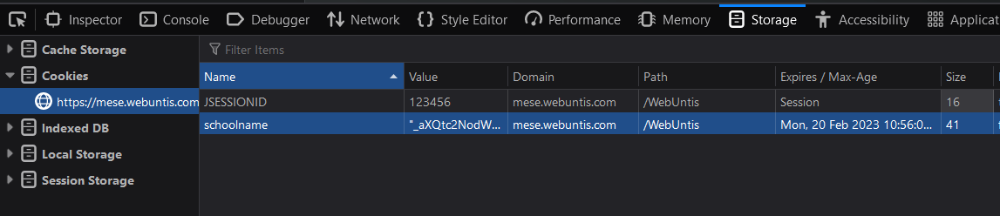
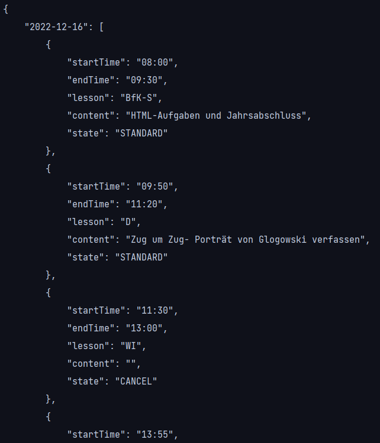
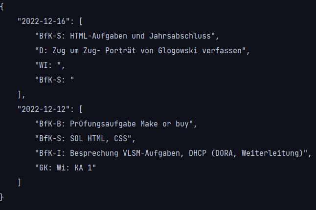

# webuntis_parser
Parsing webuntis 

## How to use:
You need python + the request package.

`py main.py -d 2022-12-12 -js B5...`

`-d | date: Formatted like 2022-12-12 | required`   
`-js | JSESSIONID: From browser | required`  
`-sn | school name: From browser, default it-schule stuttgart`  
`-sh | short: Short or long format`  

JSESSION: id must be copied from Browsers cookie storage.  
Date: A weekday of the week you want to get.

## Result:

---

### Short:

---

